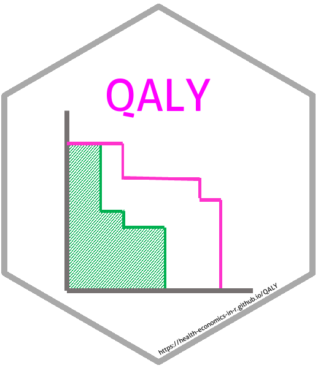

# QALY 

[](https://travis-ci.org/n8thangreen/QALY)
[](https://ci.appveyor.com/project/n8thangreen/QALY)
[](https://codecov.io/github/n8thangreen/QALY?branch=master)
[](http://github.com/badges/stability-badges)


<!-- README.md is generated from README.Rmd. Please edit that file -->

```{r, setup, echo = FALSE, message = FALSE}
knitr::opts_chunk$set(
  comment = "#>",
  tidy = FALSE,
  error = FALSE,
  fig.width = 5,
  fig.height = 5)
```

> A QALY is a QALY is a QALY

An R package for quality-adjusted life-years (QALY) calculation and manipulation.

Currently contains functions to:

- Create QALY type object
- Discounting
- Health State Utility Values (HSUV)
- Inflation-adjusted costs

## To do
Request welcome; please use [Issues](https://github.com/n8thangreen/QALY/issues)

- Other HSUV methods
- Improved plotting

> :warning: This package is in development so is not assured to work.

## Installing QALY

To install the development version from github:
```{r eval=FALSE}
library(devtools)
install_github("Health-Economics-in-R/QALY")
```

Then, to load the package, use:
```{r eval=FALSE}
library(QALY)
```


## Motivation
In cost-utility analyses arguably the most commonly used unit of health outcome is the QALY.
There are others, most notably the diability-adjusted life-year (DALY).
Calculation of QALYs consist of time and utility components.
Time may be some predefined time horizon or an individual's excess life time.
The utilities are health preference measures scaled between 0 and 1.
These can be derived from such things as patient recorded outcome measures (PROMs), using surveys such as EuroQol-5D (EQ-5D) or the Short Form-36D/Short Form-6D (SF-6D).
Co-morbidities, requiring some combining of utilities, may also be required.

QALY calculation in cost-effectiveness analyses is often done in an ad-hoc, project-by-project way.
The aim of this package is to standardise these calculations and provide an easy-to-use suite of functions for the most common operations involving QALYs.


## Basic example

```{r}
suppressMessages(library(QALY))
```

Combined two co-morbidity utilities using the product approach:

```{r}
HSUV_prod <- HSUV(method = "prod") 
tot_utility <- HSUV_prod(c(0.9, 0.8))
```

TODO use expected remaining life time...

Create a adjusted life-year type object which contains all the information needed to do subsequent operations:

```{r}
personHealthYears <-
  person_health_years(
    start_year = 2016,
    end_year = 2020,
    age = 33,
    time_horizon = NA,
    utility = tot_utility,
    discount_rate = 0.035)
```

Calculate QALYS:
```{r}
HRQoL_year <- total_QALYs(personHealthYears)
```

```{r}
print(HRQoL_year)
summary(HRQoL_year)
```


Print a graph of the HRQoL over time:
using ggplot2?

```{r}
plot(HRQoL_year)
```

See package [vignette](http://htmlpreview.github.io/?https://github.com/n8thangreen/QALY/blob/master/inst/doc/vignette_main.html) for more details and examples.

## License

GPL-3 © 
